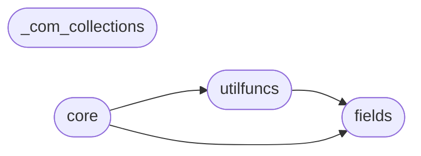

# Code Overview

[_Documentation generated by Documatic_](https://www.documatic.com)

<!---Documatic-section-Codebase Structure Python-start--->
## Codebase Structure Python

The codebase has a flat structure, with 5 code files.

<!---Documatic-block-system_architecture-start--->

<!---Documatic-block-system_architecture-end--->

# #
<!---Documatic-section-Codebase Structure Python-end--->

<!---Documatic-section-Important Functions-start--->
## Important Functions

<!---Documatic-block-important_funcs-start--->
<!---Documatic-block-most_used_funcs-start--->
### Most Utilised Functions

* [poline.utilfuncs.barchart](4-poline_utilfuncs.md#poline.utilfuncs.barchart) (1 times)
* [poline.utilfuncs.bytesize](4-poline_utilfuncs.md#poline.utilfuncs.bytesize) (1 times)
* [poline.utilfuncs.counter](4-poline_utilfuncs.md#poline.utilfuncs.counter) (1 times)
* [poline.utilfuncs.get](4-poline_utilfuncs.md#poline.utilfuncs.get) (1 times)
* [poline.utilfuncs.sh](4-poline_utilfuncs.md#poline.utilfuncs.sh) (1 times)
* [poline.utilfuncs.skip](4-poline_utilfuncs.md#poline.utilfuncs.skip) (1 times)
* [poline.utilfuncs.url](4-poline_utilfuncs.md#poline.utilfuncs.url) (1 times)
<!---Documatic-block-most_used_funcs-end--->
<!---Documatic-block-important_funcs-end--->

# #
<!---Documatic-section-Important Functions-end--->

<!---Documatic-section-Class Hierarchy-start--->
## Class Hierarchy

<!---Documatic-block-Iterator-start--->

	
<code>Iterator</code> (Click to Expand!)

* poline._com_collections.Generator

<!---Documatic-block-Iterator-end--->

<!---Documatic-block-list-start--->

	
<code>list</code> (Click to Expand!)

* poline.fields.Fields

<!---Documatic-block-list-end--->

<!---Documatic-block-str-start--->

	
<code>str</code> (Click to Expand!)

* poline.fields.Field

<!---Documatic-block-str-end--->

# #
<!---Documatic-section-Class Hierarchy-end--->

[_Documentation generated by Documatic_](https://www.documatic.com)