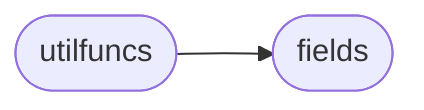

# Poline Utilfuncs

[_Documentation generated by Documatic_](https://www.documatic.com)

<!---Documatic-section-Codebase Structure-start--->
## Codebase Structure

<!---Documatic-block-system_architecture-start--->

<!---Documatic-block-system_architecture-end--->

# #
<!---Documatic-section-Codebase Structure-end--->

<!---Documatic-section-poline.utilfuncs.url-start--->
## [poline.utilfuncs.url](4-poline_utilfuncs.md#poline.utilfuncs.url)

<!---Documatic-section-url-start--->
<!---Documatic-block-poline.utilfuncs.url-start--->
<details>
	<summary><code>poline.utilfuncs.url</code> code snippet</summary>

```python
def url(url):
    if not re.match('([a-z]+:)?//', url):
        url = '//' + url
    return urlparse(url)
```
</details>
<!---Documatic-block-poline.utilfuncs.url-end--->
<!---Documatic-section-url-end--->

# #
<!---Documatic-section-poline.utilfuncs.url-end--->

<!---Documatic-section-poline.utilfuncs.counter-start--->
## [poline.utilfuncs.counter](4-poline_utilfuncs.md#poline.utilfuncs.counter)

<!---Documatic-section-counter-start--->
<!---Documatic-block-poline.utilfuncs.counter-start--->
<details>
	<summary><code>poline.utilfuncs.counter</code> code snippet</summary>

```python
def counter(l, n=10):
    return collections.Counter(l).most_common(n)
```
</details>
<!---Documatic-block-poline.utilfuncs.counter-end--->
<!---Documatic-section-counter-end--->

# #
<!---Documatic-section-poline.utilfuncs.counter-end--->

<!---Documatic-section-poline.utilfuncs.sh-start--->
## [poline.utilfuncs.sh](4-poline_utilfuncs.md#poline.utilfuncs.sh)

<!---Documatic-section-sh-start--->


### Object Calls

* poline.fields.Fields

<!---Documatic-block-poline.utilfuncs.sh-start--->
<details>
	<summary><code>poline.utilfuncs.sh</code> code snippet</summary>

```python
def sh(*args, **kwargs):
    if isinstance(args[0], list):
        cmd = args[0]
    else:
        cmd = list(args)
    shell = subprocess.Popen(cmd, stdout=subprocess.PIPE, stderr=subprocess.PIPE)
    for stdout in shell.stdout:
        if 'F' in kwargs:
            yield Fields(stdout.strip().decode().split(kwargs['F']))
        elif 's' in kwargs and kwargs['s']:
            yield Fields(stdout.strip().decode().split())
        else:
            yield stdout.strip().decode()
    for stderr in shell.stderr:
        print(stderr.strip().decode(), file=sys.stderr)
```
</details>
<!---Documatic-block-poline.utilfuncs.sh-end--->
<!---Documatic-section-sh-end--->

# #
<!---Documatic-section-poline.utilfuncs.sh-end--->

<!---Documatic-section-poline.utilfuncs.skip-start--->
## [poline.utilfuncs.skip](4-poline_utilfuncs.md#poline.utilfuncs.skip)

<!---Documatic-section-skip-start--->
<!---Documatic-block-poline.utilfuncs.skip-start--->
<details>
	<summary><code>poline.utilfuncs.skip</code> code snippet</summary>

```python
def skip(iterable, n=1):
    for n in range(n):
        next(iterable)
    return iterable
```
</details>
<!---Documatic-block-poline.utilfuncs.skip-end--->
<!---Documatic-section-skip-end--->

# #
<!---Documatic-section-poline.utilfuncs.skip-end--->

<!---Documatic-section-poline.utilfuncs.get-start--->
## [poline.utilfuncs.get](4-poline_utilfuncs.md#poline.utilfuncs.get)

<!---Documatic-section-get-start--->
<!---Documatic-block-poline.utilfuncs.get-start--->
<details>
	<summary><code>poline.utilfuncs.get</code> code snippet</summary>

```python
def get(l, i, d=None):
    if isinstance(l, _collections_Generator):
        for (j, v) in enumerate(l):
            if i == j:
                return v
        return d
    else:
        return l[i] if len(l) > i else d
```
</details>
<!---Documatic-block-poline.utilfuncs.get-end--->
<!---Documatic-section-get-end--->

# #
<!---Documatic-section-poline.utilfuncs.get-end--->

<!---Documatic-section-poline.utilfuncs.bytesize-start--->
## [poline.utilfuncs.bytesize](4-poline_utilfuncs.md#poline.utilfuncs.bytesize)

<!---Documatic-section-bytesize-start--->
<!---Documatic-block-poline.utilfuncs.bytesize-start--->
<details>
	<summary><code>poline.utilfuncs.bytesize</code> code snippet</summary>

```python
def bytesize(x, u=None, s=False):
    if not s:
        if not x.isdigit():
            return x
        else:
            x = float(x)
    units = ['P', 'T', 'G', 'M', 'K', 'B']
    offset = 0
    if u is not None and units.index(u) > 0:
        offset = len(units) - units.index(u) - 1
    for i in range(len(units)):
        if x == 0:
            return '{:6.2f} {}'.format(0, units[-1])
        if x // 1024 ** (len(units) - i - 1 - offset) > 0:
            return '{:6.2f} {}'.format(x / float(1024 ** (len(units) - i - 1 - offset)), units[i])
```
</details>
<!---Documatic-block-poline.utilfuncs.bytesize-end--->
<!---Documatic-section-bytesize-end--->

# #
<!---Documatic-section-poline.utilfuncs.bytesize-end--->

<!---Documatic-section-poline.utilfuncs.barchart-start--->
## [poline.utilfuncs.barchart](4-poline_utilfuncs.md#poline.utilfuncs.barchart)

<!---Documatic-section-barchart-start--->
<!---Documatic-block-poline.utilfuncs.barchart-start--->
<details>
	<summary><code>poline.utilfuncs.barchart</code> code snippet</summary>

```python
def barchart(x, p=False, w=10):
    if sys.version_info >= (3, 0):
        d = '▓'
        l = '░'
    else:
        d = u'▓'.encode('utf-8')
        l = u'░'.encode('utf-8')
    if p:
        x = int(round(x * w))
        return d * x + l * (w - x)
    else:
        return d * x
```
</details>
<!---Documatic-block-poline.utilfuncs.barchart-end--->
<!---Documatic-section-barchart-end--->

# #
<!---Documatic-section-poline.utilfuncs.barchart-end--->

[_Documentation generated by Documatic_](https://www.documatic.com)