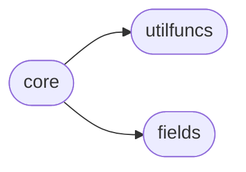
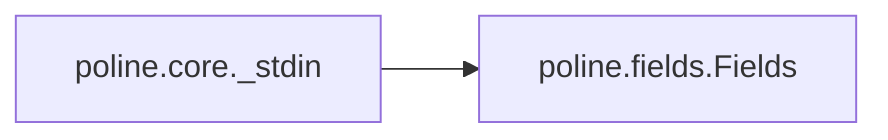
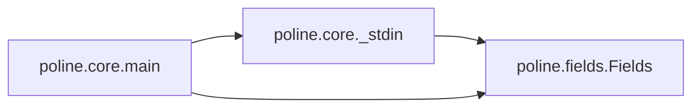

# Poline Core

[_Documentation generated by Documatic_](https://www.documatic.com)

<!---Documatic-section-Codebase Structure-start--->
## Codebase Structure

<!---Documatic-block-system_architecture-start--->

<!---Documatic-block-system_architecture-end--->

# #
<!---Documatic-section-Codebase Structure-end--->

<!---Documatic-section-poline.core._len-start--->
## [poline.core._len](5-poline_core.md#poline.core._len)

<!---Documatic-section-_len-start--->
<!---Documatic-block-poline.core._len-start--->
<details>
	<summary><code>poline.core._len</code> code snippet</summary>

```python
def _len(value):
    if isinstance(value, _collections_Generator):
        return sum((1 for x in value))
    else:
        return len(value)
```
</details>
<!---Documatic-block-poline.core._len-end--->
<!---Documatic-section-_len-end--->

# #
<!---Documatic-section-poline.core._len-end--->

<!---Documatic-section-poline.core._stdin-start--->
## [poline.core._stdin](5-poline_core.md#poline.core._stdin)

<!---Documatic-section-_stdin-start--->


### Object Calls

* poline.fields.Fields

<!---Documatic-block-poline.core._stdin-start--->
<details>
	<summary><code>poline.core._stdin</code> code snippet</summary>

```python
def _stdin(args):
    for line in sys.stdin:
        if args.separator is not None:
            yield Fields(line.strip().split(args.separator))
        elif args.split:
            yield Fields(line.strip().split())
        else:
            yield line.strip()
    sys.stdin.close()
```
</details>
<!---Documatic-block-poline.core._stdin-end--->
<!---Documatic-section-_stdin-end--->

# #
<!---Documatic-section-poline.core._stdin-end--->

<!---Documatic-section-poline.core.main-start--->
## [poline.core.main](5-poline_core.md#poline.core.main)

<!---Documatic-section-main-start--->


### Object Calls

* [poline.core._stdin](5-poline_core.md#poline.core._stdin)
* poline.fields.Fields

<!---Documatic-block-poline.core.main-start--->
<details>
	<summary><code>poline.core.main</code> code snippet</summary>

```python
def main(argv=None):
    parser = argparse.ArgumentParser()
    parser.add_argument('expression', nargs='+', help='python expression')
    parser.add_argument('-F', '--separator', default=None, help='split each line by SEPARATOR')
    parser.add_argument('-s', '--split', const=True, default=False, action='store_const', help='split each line')
    parser.add_argument('-q', '--quiet', const=True, default=False, action='store_const', help="don't implicitly print results")
    if argv is not None:
        args = parser.parse_args(argv)
    else:
        args = parser.parse_args()
    result = _stdin(args)
    for expression in args.expression:
        separator = None
        new_result = []
        if expression.startswith('|') or expression.startswith('%'):
            if expression.startswith('%'):
                expression = expression[1:]
                exp_parts = expression.split('%')
                separator = exp_parts[0]
                expression = '%'.join(exp_parts[1:])
            else:
                expression = expression[1:]
            for result_line in result:
                if separator:
                    result_parts = Fields(result_line.split(separator))
                else:
                    result_parts = Fields(result_line.split())
                invars = {'_': result, '__': result_parts, '__str': result_line, 'len': _len}
                for result_pard_idx in range(len(result_parts) + 10):
                    invars['_{}'.format(result_pard_idx)] = result_parts[result_pard_idx]
                new_result += [eval('(%s)' % expression, globals(), invars)]
            result = new_result
        elif expression.startswith(':'):
            invars = {'_': result, 'len': _len}
            expression = expression[1:]
            exp_parts = expression.split(':')
            tuples = exp_parts[0]
            expression = '{} {}'.format(':'.join(exp_parts[1:]), 'for ({}) in _'.format(tuples))
            result = eval('(%s)' % expression, globals(), invars)
        else:
            invars = {'_': result, 'len': _len}
            result = eval('(%s)' % expression, globals(), invars)
    if argv is not None:
        return result
    if not args.quiet:
        if isinstance(result, (list, _collections_Generator)):
            for line in result:
                if isinstance(line, (list, tuple)):
                    print(*line)
                else:
                    print(line)
        else:
            print(result)
```
</details>
<!---Documatic-block-poline.core.main-end--->
<!---Documatic-section-main-end--->

# #
<!---Documatic-section-poline.core.main-end--->

[_Documentation generated by Documatic_](https://www.documatic.com)